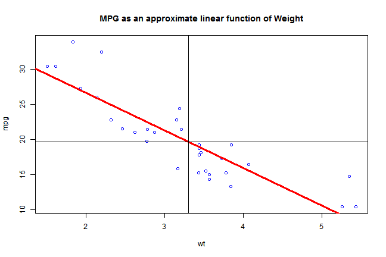

## Background: 1974 Motor Trend dataset
Data on fuel consumption and 10 aspects of automobile design and performance for 32 automobiles (1973-74 models), e.g.:

```r
head(mtcars)
```

```
##                    mpg cyl disp  hp drat    wt  qsec vs am gear carb
## Mazda RX4         21.0   6  160 110 3.90 2.620 16.46  0  1    4    4
## Mazda RX4 Wag     21.0   6  160 110 3.90 2.875 17.02  0  1    4    4
## Datsun 710        22.8   4  108  93 3.85 2.320 18.61  1  1    4    1
## Hornet 4 Drive    21.4   6  258 110 3.08 3.215 19.44  1  0    3    1
## Hornet Sportabout 18.7   8  360 175 3.15 3.440 17.02  0  0    3    2
## Valiant           18.1   6  225 105 2.76 3.460 20.22  1  0    3    1
```

---

## A Car's MPG Is Predominantly Determined by Its Weight
Result from simple linear regression model of MPG on Weight:

```r
model <- lm(mpg ~ wt, mtcars)
model
```

```
## 
## Call:
## lm(formula = mpg ~ wt, data = mtcars)
## 
## Coefficients:
## (Intercept)           wt  
##      37.285       -5.344
```
* In terms of Adjusted R Squared, Weight explains **0.7445939** (i.e. almost 3/4) of the variation in MPG

* In terms of P-value, Weight is statistically highly significant

---

## Shiny App: Predictive Model of MPG according to Weight

```r
illusWeight <- 3.3
dataFrame <- as.data.frame(illusWeight)
names(dataFrame) <- 'wt'
predMPG <- predict(model, dataFrame)
            
plot(mpg ~ wt, mtcars, col = 'blue')
title('MPG as an approximate linear function of Weight')
abline(model, col = 'red', lwd = 3)
abline(v = illusWeight)
abline(h = predMPG)
```

 

---

## Shiny App: Link & How-to-Use

* Go to weblink: https://luongthevinh.shinyapps.io/predictMPG/

* Simply specify your car's weight using the input slider, and see the interactive graph show the predicted MPG

* Have FUN!!!
